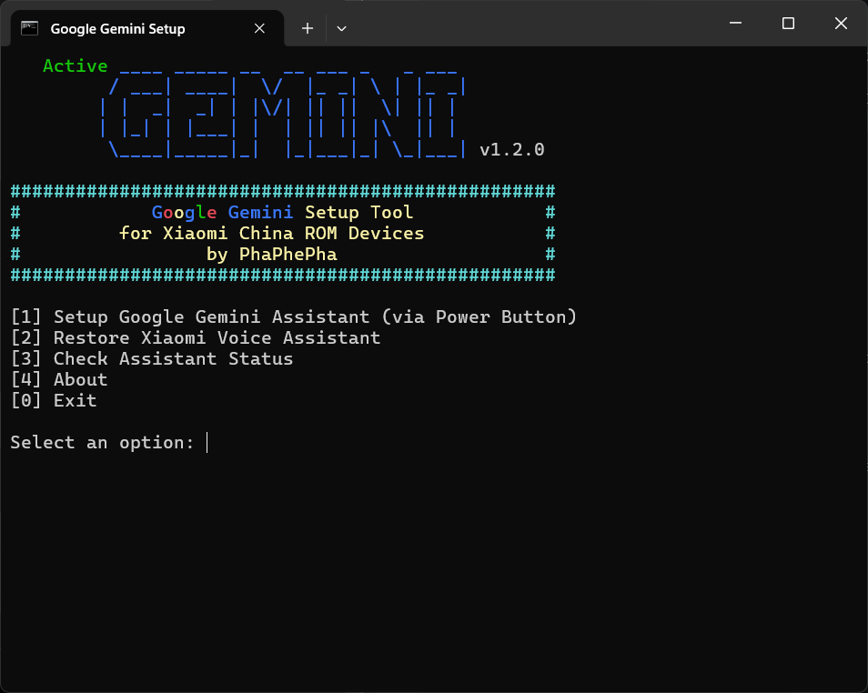
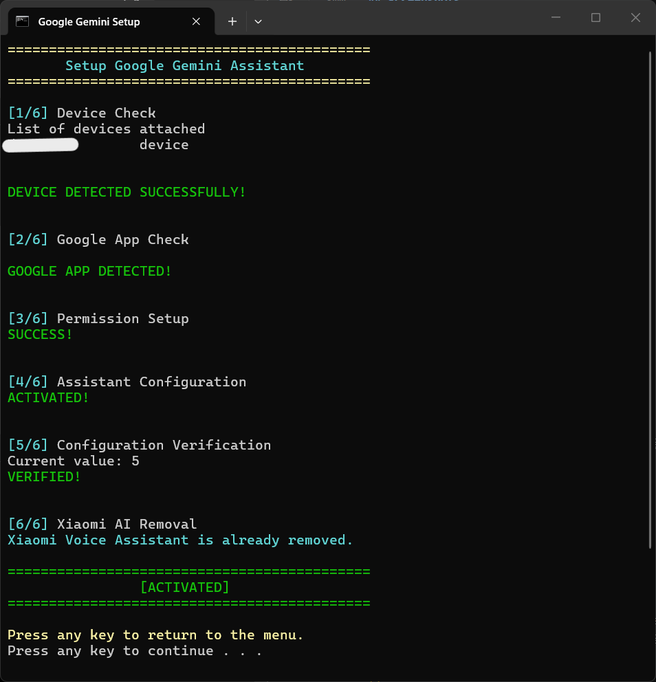
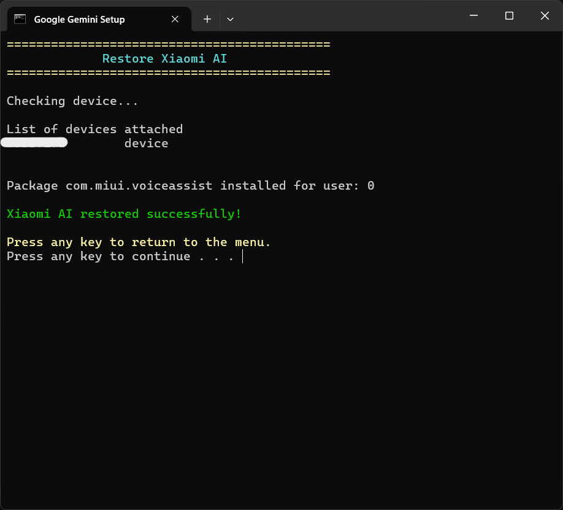
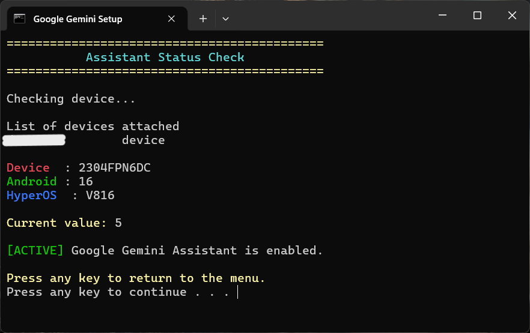
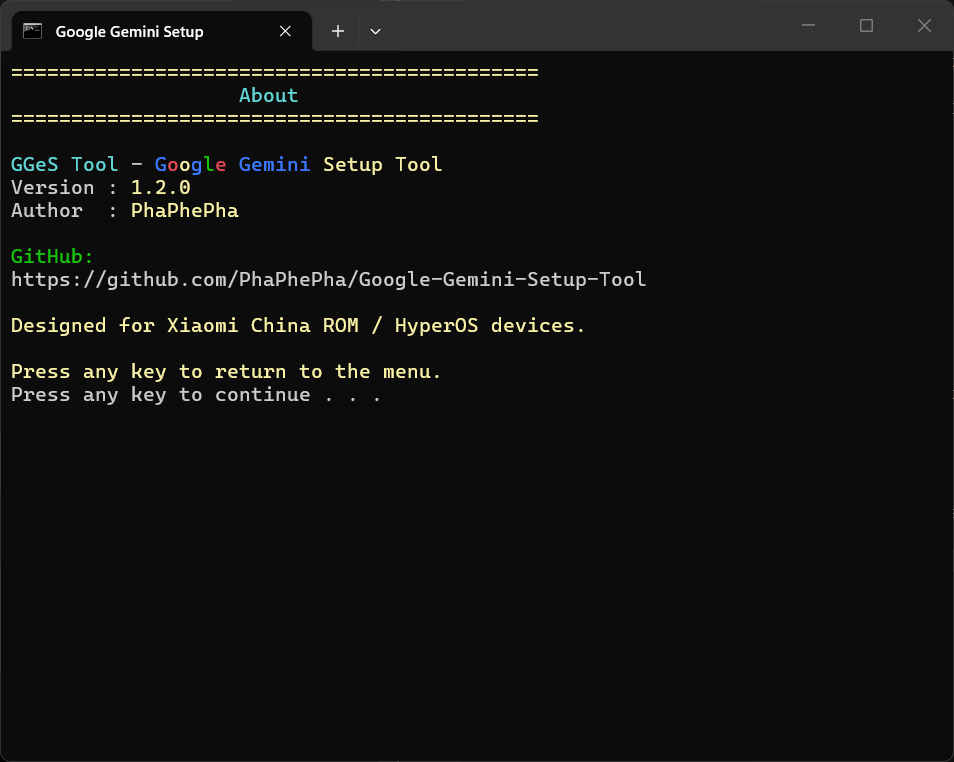

# Google Gemini Setup Tool
### For Xiaomi China ROM / HyperOS Devices



A lightweight ADB batch tool that enables **Google Gemini Assistant** on Xiaomi devices running **China ROM / HyperOS**.

This tool automates the ADB commands required to enable Google Gemini on Xiaomi China ROM devices, providing a simple interactive menu for activation, restoration, and status checking.

---

## Features

✔ Enable Google Gemini via Long Press Power Button

✔ Grant required microphone permission automatically

✔ Disable Xiaomi Voice Assistant

✔ Restore Xiaomi Voice Assistant anytime

✔ Check current Assistant status

✔ Detect unauthorized devices

✔ Detect missing devices

✔ Detect missing ADB installation

✔ Detect Google App installation

---

## Requirements

### Device Requirements

- Xiaomi device
- HyperOS / MIUI China ROM
- Google App installed
- USB Debugging enabled

### PC Requirements

- Windows 10 / Windows 11
- ADB installed and added to PATH

Verify ADB installation:

```cmd
adb version
```

---

## Enable USB Debugging

1. Open **Settings**
2. Go to **About Phone**
3. Tap **OS Version** 7 times to enable Developer Options
4. Open **Developer Options**
5. Enable:

- USB Debugging
- USB Debugging (Security Settings) *(if available)*

6. Connect device to PC
7. Allow the RSA fingerprint prompt

---

## Usage

Run:

```cmd
Activation_google_gemini_assistant.bat
```

You will see:

```text
[1] Enable Google Gemini (Long Press Power Button)
[2] Restore Xiaomi Voice Assistant
[3] Check Assistant Status
[0] Exit
```

---

## Option 1
### Enable Google Gemini

This option will:

1. Verify device connection

2. Verify Google App installation

```cmd
adb shell pm list packages | findstr "com.google.android.googlequicksearchbox"
```

3. Grant microphone permission:

```cmd
adb shell pm grant com.google.android.googlequicksearchbox android.permission.RECORD_AUDIO
```

4. Configure Power Button Assistant:

```cmd
adb shell settings put global power_button_long_press 5
```

5. Verify configuration

6. Disable Xiaomi Voice Assistant:

```cmd
adb shell pm uninstall -k --user 0 com.miui.voiceassist
```

After completion:

```text
[ACTIVATED]
```

---

## Option 2
### Restore Xiaomi Voice Assistant

Restores the original Xiaomi Assistant:

```cmd
adb shell cmd package install-existing com.miui.voiceassist
```

---

## Option 3
### Check Assistant Status

Checks:

```cmd
adb shell settings get global power_button_long_press
```

Results:

```text
[ACTIVE]
Google Gemini is enabled.
```

or

```text
[INACTIVE]
Google Gemini is not enabled.
```

---

## What Does This Tool Change?

### Enable Gemini

```cmd
adb shell settings put global power_button_long_press 5
```

Meaning:

```text
Long Press Power Button
        ↓
Launch Google Gemini
```

### Disable Xiaomi Assistant

```cmd
adb shell pm uninstall -k --user 0 com.miui.voiceassist
```

This removes Xiaomi Voice Assistant only for the current user.

System files remain untouched.

---

## Safety

This tool:

- Does NOT unlock bootloader
- Does NOT root the device
- Does NOT modify system partitions
- Does NOT erase user data

All changes can be reverted using:

```text
[2] Restore Xiaomi Voice Assistant
```

---

## Tested On

- Xiaomi HyperOS 1
- Xiaomi HyperOS 2
- Xiaomi HyperOS 3
- Xiaomi HyperOS 3.1
- Android 15
- Android 16

Additional versions may also work but have not been fully tested.

---

## Troubleshooting

### Device Unauthorized

Unlock your phone and accept the USB debugging authorization prompt.

---

### No Device Detected

Check:

- USB cable
- USB Debugging
- ADB installation

Verify:

```cmd
adb devices
```

---

### Google App Not Installed

Install Google App first:

Package:

```text
com.google.android.googlequicksearchbox
```

---

### Permission Denied / SecurityException

If activation fails with a permission-related error:

Enable the following options in Developer Options:

- USB Debugging
- USB Debugging (Security Settings)
- Install via USB

Then run the tool again.

---

## Known Limitation

On some HyperOS versions, Google Gemini activation may be reset after a device reboot.

If this happens, simply run:

```text
[1] Setup Google Gemini Assistant (via Power Button)
```

again.

This behavior is controlled by HyperOS and cannot be permanently overridden without root access.

---

## Disclaimer

This tool is not affiliated with Xiaomi or Google.

Use at your own risk. Always review the included ADB commands before running the tool.

---

## Screenshots

### Main Menu


### Activation Process



### Restore Process



### Status Check



### About



---

## Download

Download latest version here:
[Releases](https://github.com/PhaPhePha/Google-Gemini-Setup-Tool/releases)

---

## Changelog

### v1.2.0

- Added ADB detection before launch
- Added Google App detection step
- Expanded setup workflow from 5 steps to 6 steps
- Fixed WRITE_SECURE_SETTINGS activation issues reported by users
- Improved HyperOS permission error handling
- Updated UI and version information
- General stability improvements

---

## Author

**PhaPhePha**

GitHub:
https://github.com/PhaPhePha

---

## License

This project is licensed under the MIT License.
See the LICENSE file for details.
